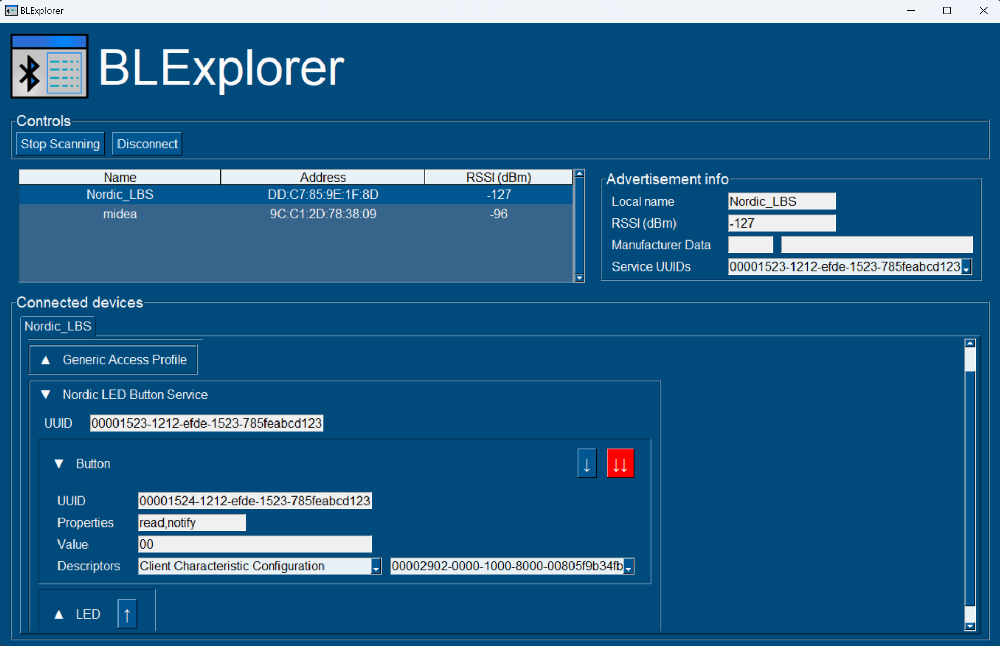

## blexplorer

App for exploring Bluetooth Low Energy devices.

## Features

- Discovering of nearby BLE devices
- Connecting to multiple BLE devices
- Showing services and characteristics, including their properties
- Read, write and notify operations on characteristics (indicate not implemented yet)

## Prerequisites

The app is build in Python, with [bleak](https://bleak.readthedocs.io/en/latest/) for handling the BLE part, and [PySimpleGUI](https://www.pysimplegui.org/en/latest/) for the GUI.

Python requirements can be installed by running `pip install -r requirements.txt`.

Executable can be created by running:

`pyinstaller --onefile --windowed -i "resources/blexplorer.ico" --workpath "." --distpath "build" --add-data "resources/blexplorer.ico;resources" --add-data "resources/blexplorer.png;resources" blexplorer.py`

## TODO

1. Saving raw data read from characteristic
2. Window with hex preview for characteristic data